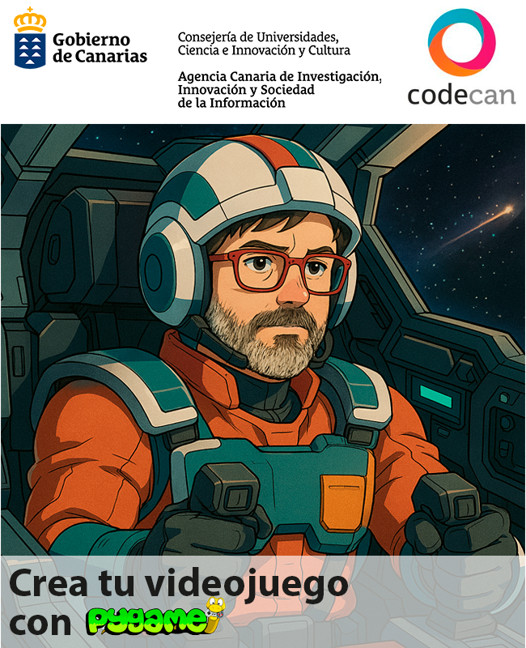
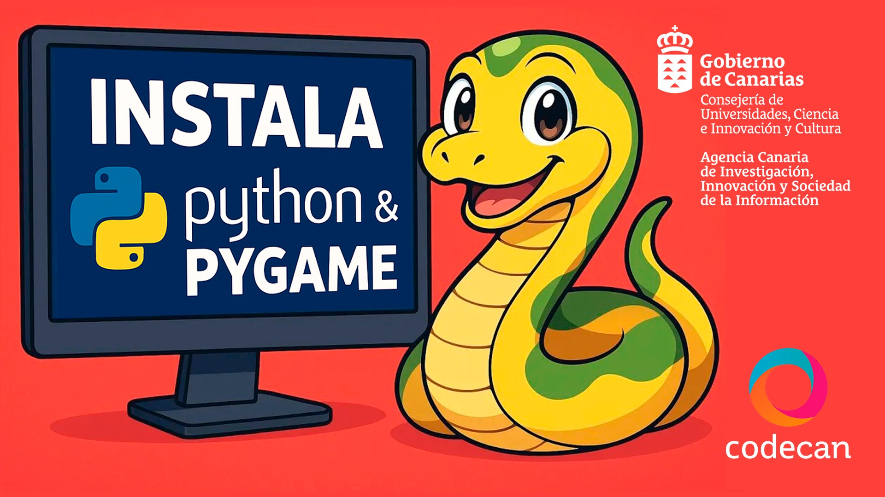

# Space Ship

Juego de disparos espacial desarrollado con Pygame, organizado de forma modular para facilitar su comprensión y mantenimiento.

<p align="center">
  
</p>

## 🚀 Características

- **Nave Jugadora:** controlada con las flechas del teclado y dispara con la barra espaciadora.
- **Enemigos:** asteroides que caen desde la parte superior con rotación aleatoria.
- **Proyectiles:** limitados a un disparo activo para evitar spam.
- **Explosiones Animadas:** en dos tamaños (pequeño y grande) y efecto especial para la nave.
- **Interfaz (HUD):** marcador de puntuación y barra de vida con indicadores visuales.
- **Menú Inicial:** pantalla de bienvenida con opciones de Jugar y Salir.
- **Audio:** música de fondo y efectos de disparo/explosión.

## 📂 Estructura del Proyecto

```
SpaceShipProject_Modular/
├── assets/              # Imágenes (.png, .gif) y sonidos (.wav)
├── settings.py          # Constantes globales y rutas
├── utils.py             # Funciones de dibujo (texto, marcador, salud)
├── sprites.py           # Clases de objetos del juego
├── menu.py              # Lógica y renderizado del menú inicial
├── game.py              # Bucle de partida: eventos, colisiones, HUD
└── main.py              # Punto de entrada: inicialización y bucle principal
```

## ⚙️ Instalación

1. Clona el repositorio:
```bash
git clone https://github.com/tu-usuario/SpaceShipProject_Modular.git
cd SpaceShipProject_Modular
```
2. Asegúrate de tener la carpeta `assets/` con todos los archivos multimedia.
3. Instala Pygame:
```bash
pip install pygame
```
4. 📺 Video tutorial de instalación (Si empiezas de cero esto puede serte útil)
Para guiarte paso a paso en la instalación de Python y Pygame, consulta nuestro video tutorial:
<p align="center"> <a href="https://www.youtube.com/watch?v=0j1R6CA_A5M">  </a> </p>
▶️ Instalación de Python (32 bits) y Pygame
https://www.youtube.com/watch?v=0j1R6CA_A5M

    “¿Listo para comenzar a crear tu propio videojuego? En este video te enseño cómo instalar Python (32 bits) y Pygame paso a paso. Sigue estos pasos y estarás más cerca de convertirte en un desarrollador de videojuegos. ¡No olvides apuntarte a nuestro Taller ‘Crea Tu Videojuego’! 🚀

    🔗 Enlaces importantes:
    • Web de Python (descarga 32 bits): https://www.python.org/ftp/python/3.1...
    • Web de Pygame: https://pypi.org/project/pygame/
    • Apúntate al Taller “Crea Tu Videojuego” en CODECAN

    ⚙️ Pasos para instalar Python (32 bits):
    ✅ Ejecuta como administrador.
    ✅ Marca “Add python.exe to PATH”.
    💻 En CMD, ejecuta py --version para verificar.

    ⚙️ Instalando y probando Pygame:
    1️⃣ pip install pygame
    2️⃣ py -m pygame.examples.aliens
    3️⃣ En IDLE, prueba:

    print("Prueba de Python para curso de CODECAN")
    import pygame, sys; print("Si esto funciona estamos listos")

    ¡Y listo! Ya tienes el entorno preparado.

## ▶️ Uso

Ejecuta el juego con:

```bash
python main.py
```

- **Iniciar Menú:** usa ENTER o clic en "JUGAR".
- **Controles del Juego:**
  - Flechas ◀▲▶▼ para mover la nave.
  - Barra espaciadora para disparar.
- **Salir:** ESC en menú o cerrar la ventana.

## 📝 Módulos Principales

- **settings.py:** configuración global (dimensiones, FPS, colores, rutas).
- **utils.py:** funciones reutilizables para renderizar texto, marcador y barra de vida.
- **sprites.py:** definición de clases `Player`, `Mob`, `Bullet` y `Explosion`.
- **menu.py:** implementación de `show_menu()` con lógica de botones.
- **game.py:** implementación de `run_game()` con bucle de eventos, colisiones y dibujo.
- **main.py:** inicialización de Pygame, carga de recursos, inyección de dependencias y bucle principal.

## Ejercicios

Para asegurar que entiendes todo lo que se cubre en el taller y poder hacer el juego se diseñaron unos ejercicios básicos de introducción a los conceptos fundamentales que se usan en el proyecto

## 🚀 Ejercicios básicos de introducción

1. 📦 **Ejercicio 1: Módulos y constantes globales**  
   **Objetivo:** Organizar la configuración en `settings.py` e importar sus constantes (`WIDTH`, `HEIGHT`, `FPS`, colores) desde `main.py`, comprobando en consola que funcionan correctamente.

2. 🛠️ **Ejercicio 2: Funciones y retorno**  
   **Objetivo:** Definir funciones en Python que reciban parámetros y devuelvan valores. Reescribir `draw_score` como `format_score(text)` para formatear y devolver la puntuación.

3. 📋 **Ejercicio 3: Listas y comprensiones**  
   **Objetivo:** Practicar list‑comprehensions y bucles. Generar la lista `['asteroid1.gif', ..., 'asteroid12.gif']` primero con comprensión y después con un `for`, verificando que son idénticas.

4. 🕹️ **Ejercicio 4: Clases e herencia en Pygame**  
   **Objetivo:** Introducir POO en Pygame: crear `SimpleSprite` heredando de `pygame.sprite.Sprite`, definiendo `image` y `rect`, y moviéndolo con `update()`.

5. 🔄 **Ejercicio 5: Bucle principal de Pygame**  
   **Objetivo:** Construir el esqueleto de un juego: inicializar Pygame, crear ventana, gestionar el bucle `while` con `clock.tick(FPS)`, procesar `QUIT`, pintar fondo y actualizar pantalla.

6. ✨ **Ejercicio 6: Función genérica `new_object`**  
   **Objetivo:** Usar `*args` y `**kwargs` para crear una utilidad que instancie cualquier sprite, lo añada a un grupo y lo devuelva, integrándolo en un mini‑proyecto completo.


## 📄 Licencia

Proyecto bajo licencia **MIT** © 2025 Ayose Lomba Pérez

